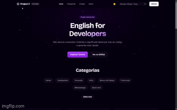

<div align="center">

  <div align="center">
  <h1>English for Devs - Dicionário Tech</h1>
      
</div>
</div>


> **"Não decore comandos. Entenda o significado literal por trás do código."**

O **English for Devs** é uma base de conhecimento interativa desenvolvida para descomplicar a terminologia técnica em inglês. O projeto conecta o significado literal de termos técnicos (por exemplo, *Fetch* = "Ir buscar") à sua função real no código, tornando o aprendizado de programação mais intuitivo e acessível para desenvolvedores brasileiros.

**Projeto desenvolvido durante a Imersão Dev com Google Gemini e Alura.**


---

<div align="center">
  <h2>O que ele resolve?</h2>
    
</div>

Muitos iniciantes enfrentam dificuldades na programação porque os termos técnicos parecem abstratos e desconectados de seu significado real. Nesta aplicação, você busca um termo e descobre:

1. **Tradução Literal:** A origem da palavra no inglês cotidiano.
2. **Explicação Técnica:** O que ela faz no código, de forma clara e objetiva.
3. **Contextualização:** Categoria gramatical e técnica do termo.
4. **Aprofundamento:** Link direto para documentações oficiais (MDN, Git-scm, etc.).


---

<div align="center">
  <h2>Funcionalidades e Diferenciais</h2>
    
</div>

* **Busca Inteligente:** Filtragem em tempo real por termo, tradução ou explicação técnica.
* **Interface Moderna:** Design com efeito glassmorphism, animações de partículas em Canvas e transições suaves.
* **Filtros Dinâmicos:** Navegação organizada por categorias (Verbos, Infraestrutura, Front-end, etc.).
* **Alternância de Tema:** Modo claro e escuro com persistência de preferência do usuário.
* **Integração com API:** Seção de artigos que consome conteúdo atualizado do Dev.to.
* **Conteúdo Gerado por IA:** Base de dados inicial estruturada com auxílio do Google Gemini.


---

<div align="center">
  <h2>Tecnologias Utilizadas</h2>
</div>  

Este projeto foi construído com foco nos fundamentos da web moderna, sem uso de frameworks JavaScript (como React ou Vue), garantindo performance e leveza.

* **HTML5 Semântico:** Estrutura acessível e bem organizada.
* **CSS3 Moderno:** Uso de CSS Variables, Grid, Flexbox e animações com keyframes.
* **JavaScript Vanilla:** Lógica de busca, manipulação do DOM, consumo de APIs e renderização de Canvas.
* **Google Gemini + Node.js:** Script de automação (`gerador.js`) para expandir a base de dados (`data.json`) de forma automatizada.


---

<div align="center">
  <h2>Como Rodar Localmente</h2>
</div>  

O projeto é estático e não requer instalação de dependências para execução no navegador.

1.  **Clone o repositório:**
    ```bash
    git clone https://github.com/TheRazorbill/Projeto-Alura
    ```
2.  **Abra a pasta do projeto** no VS Code ou editor de sua preferência.
3.  **Execute:** Utilize a extensão "Live Server" para abrir o `index.html` ou abra o arquivo diretamente no navegador.

> **Nota:** O arquivo `package.json` e os scripts Node.js servem apenas para automação de geração de dados via IA, não sendo necessários para visualizar o site.


---

<div align="center">
  <h2>Demonstração Online</h2>
</div> 

Acesse a aplicação em funcionamento:

**[English for Devs - Demo ao Vivo](https://therazorbill.github.io/Projeto-Alura/)**


<div align="center">

</div>


---

<div align="center">
  <h2>Créditos</h2>
</div> 

Desenvolvido por **RazorBill** como projeto final da **Imersão Dev Alura + Google**.

* **Design:** Inspirado em conceitos de React Bits e Material Design.
* **Geração de Dados:** Google Gemini 2.5.
* **Apoio Educacional:** Alura.